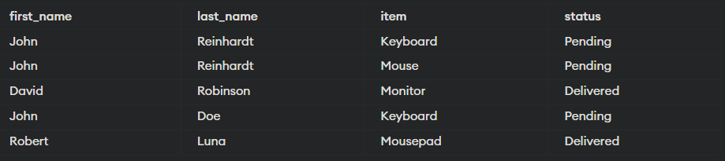

# Mirror CS Course 2022 Summer

## Lesson 1 Homework

`src/sorting_algorithms/sorting`

complete the 4 blank sorting algorithms

to test them
1. run `sorting_algorithms/testing_main.py` to test your code
2. you can see plots of time used in `plots`, file name is `Time used vs Lengths.png`

## Lessson 2 Homework

`src/sorting_algorithms/sorting`

complete **count sort** and **radix sort**

to test them
1. run `sorting_algorithms/testing_main.py` to test your code
2. you can see plots of time used in `plots`, file name is `Time used vs Lengths (Linear Sorts).png`

## Lesson 3 Homework

`src/data_structures/binary_search_tree` and `src/data_structures/heap`

complete functions of the 2 data structures

to test them
1. install dependency `graphviz` by running `pip install graphviz` in command line
2. run `data_structures/testing_main.py` to test your code
3. you can see plots of time used in `plots/bsts` and `plots/heaps`

## Lesson 4 Homework

### 作业提交

> 完成这次的作业后请把作业发到我的企业微信。前3次作业已完成的同学请把test通过的截图（或者代码截图）发到我的企业微信。谢谢。

### Warm up question

Find the union, and intersection of: 

a) $\{ 1, 2, 3, 4,5\}$ and $\{−1, 1, 3, 5,7\}$

b) $\{ x ∈ \text{R} | x > 7\}$ and $\{ x ∈ \text{R} | x > 5\}$

### Proof question

#### Question 1

prove the universal properties of set union and intersection, for sets $A,B \subseteq D$ (D is the domain)
1. $\forall X\subseteq D. A \cup B \subseteq X \iff (A \subseteq X \text{ and } B \subseteq X)$
2. $\forall X\subseteq D, X\subseteq A \text{ and } X\subseteq B \iff X \subseteq (A\cap B)$

Hints:
- remember how to prove 'if and only if' (two steps)
- use the definitions of $\cup$ and $\cap$
	1. $\forall x, x\in A\cup B \iff x\in A \vee x\in B$ 
	2. $\forall x, x\in A\cap B \iff x\in A \wedge x\in B$ 
- use the definition of $\subseteq$
	- $A\subseteq B\iff \forall a \in A,a\in B$

#### Question 2
	
prove the universal properties of big union and big intersection, for a family of sets  $F \subseteq P(D)$ (D is the domain)
1. $\forall X \subseteq D. \bigcup F \subseteq X \iff (\forall S \in F, S \subseteq X)$
2. $\forall X \subseteq D. X \subseteq \bigcap F \iff (\forall S\in F, X\subseteq S)$

Hints:
- $F$ is a set of sets
- the proof is quite similar to the previous proof

### Lesson 5 Homework

#### Relations Question

Let A={1,2,3,4}, B={a,b,c,d} and C={x,y,z}. 
Let R = {(1,a),(2,d),(3,a),(3, b),(3,d)}: A → B and S = {(b, x),(b, y),(c, y),(d,z)}: B → C.
    
Draw the internal diagrams of the relations. What is the composition S ◦ R : A → C.

#### SQL Question

go to the [online editor](https://www.programiz.com/sql/online-compiler/)

query the table with columns: cutomer - item - status

**NOTE**: assume `order_id` is the same as `shipping_id`

result should look like:

